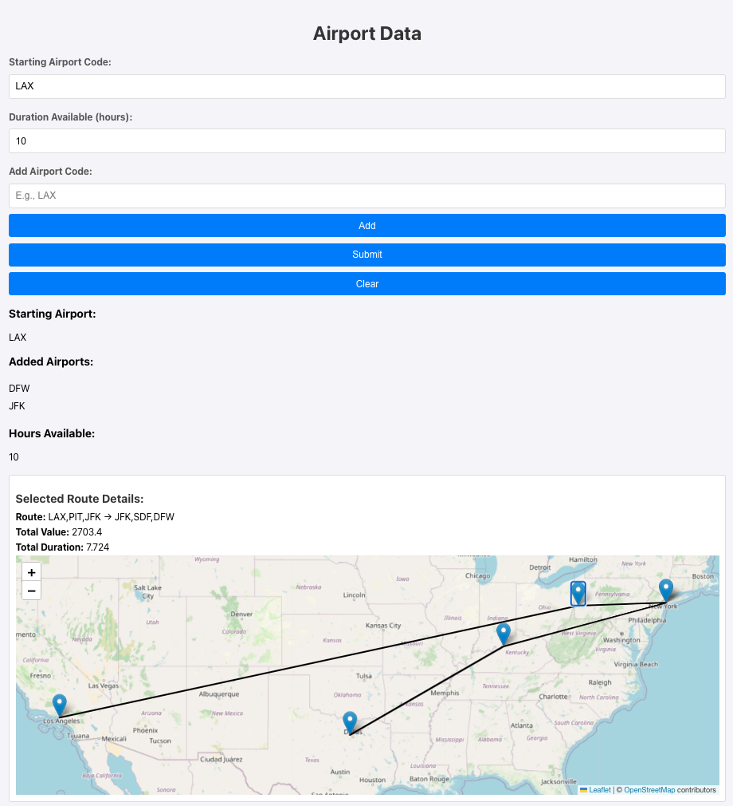

# ✈️ Airline Route Optimization with Neo4j and Graph Data Science

This React App offers a solution to optimize airline routes based on available flight hours using Neo4j's Graph Data Science (GDS) library.

Imagine you're a pilot with only 15 working hours left for the week. How do you maximize your earnings? Sure, you could manually search for the most lucrative routes, but why settle for guesswork? This notebook automates the process, providing an optimal flight schedule that tells you exactly which routes to fly to make the most out of your remaining time.

> **Current Status:**  
> The application is being actively updated. Right now, you can enter desired airport codes, and it will filter down the codes from the Neo4j database.

### 🛠 How It Works
- **Yen's K-Shortest Path Algorithm** is employed to identify multiple shortest paths between airports.
- Users can input any number of airport codes, and the notebook will generate the possible routes.
- A **linear programming** step at the end calculates the optimal path, maximizing earnings while considering the time constraints.

---

## 🚀 Setup

To get started, you'll need a Neo4j instance with Graph Data Science installed:

1. **Option 1:** [Get started with AuraDS](https://neo4j.com/product/auradb/)
2. **Option 2:** Download and install [Neo4j Desktop with GDS](https://neo4j.com/download/)

After you install Neo4j, you will need to upload the neo4j.dump file from this repo into your database.

You will also need to install some python libraries:

1. `graphdatascience`

    ```
    pip install graphdatascience
    ```
2. `pulp`
    ```
    pip install pulp
    ```

Once you have the above installed we can begin the process of getting what we need ready for the React App

1. Check that you have installed Node.js and npm
   ```
   node -v
   npm -v
   ```
   If you don't, download and intall it from [here](https://nodejs.org/en)

2. Clone this repo
3. Install React App Dependencies
   >Navigate to the src folder (or whereever your React app is located) and run:
   ```
   npm install
   ```
4. Set Up Environment Variables
   >Create a .env file in the root of your project directory (where your server.js file is located) and add your Neo4j credentials:
   ```
   REACT_APP_AURADS_USERNAME=username
   REACT_APP_AURADS_PASSWORD=password
   REACT_APP_AURADS_HOST=neo4j+s://xxxxxxxx.databases.neo4j.io
   ```
5. Install Server Dependencies
   >In the same directory where server.js is located, install the backend dependencies:
   ```
   npm install express neo4j dotenv cors
   ```
6. Install Leaflet Dependencies
   >For your map component (MapComponent.js), make sure leaflet and react-leaflet are installed:
   ```
   npm install leaflet react-leaflet
   ```
7. Start the React App
   >In the project folder (where package.json is), start your React app:
   ```
   npm start
   ```
   The app should be available at http://localhost:3000.
8. Start the Backend Server
   >In another terminal, navigate to the same project folder and run:
   ```
   node server.js
   ```
   The server will run on port 3001 (or whatever port you've set) and will handle API requests from your React app.


---

## 📓 Usage Instructions

1. Input a start airport code
2. Input the number of hours you have available
   - This will limit what flights you take
3. On the "Add Airport Code" line, input an airport code and click "Add". You can do this as many times as you would like but keep in mind, the more airports the longer it will take to run
4. Once you have all the items filled out, click "Submit" to run and get results
5. The results will be displayed with the optimal path, value, time, and a map showing the route
6. When you are ready to run a new set, click "Clear"
7. Enjoy exploring optimized routes and maximizing your value!

---
## Example Output


